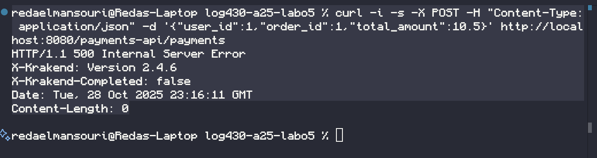
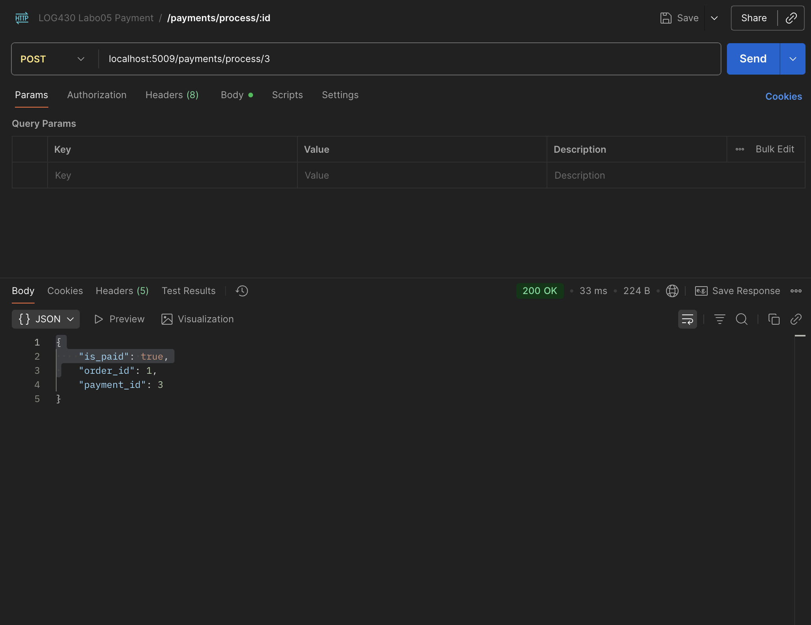
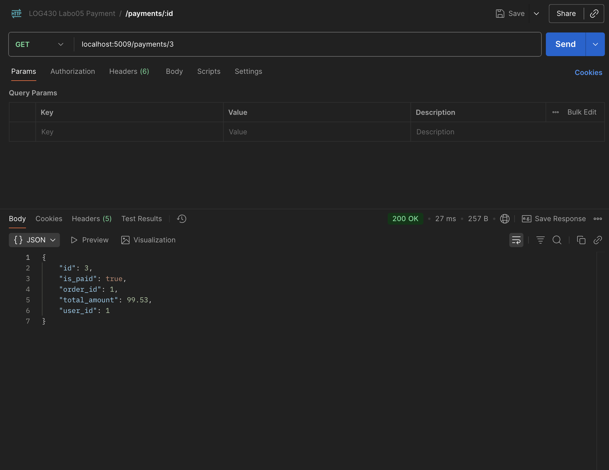
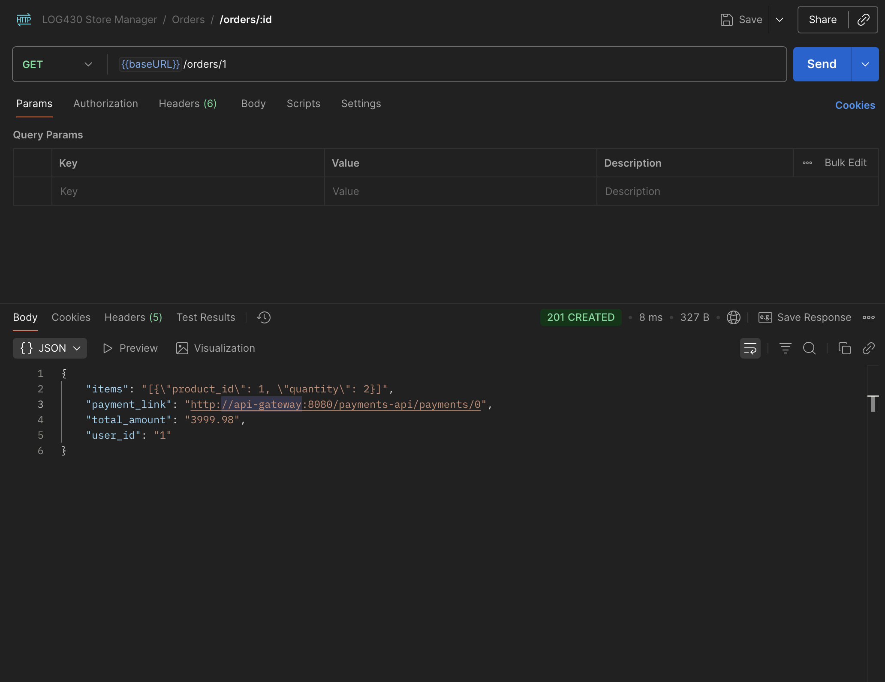
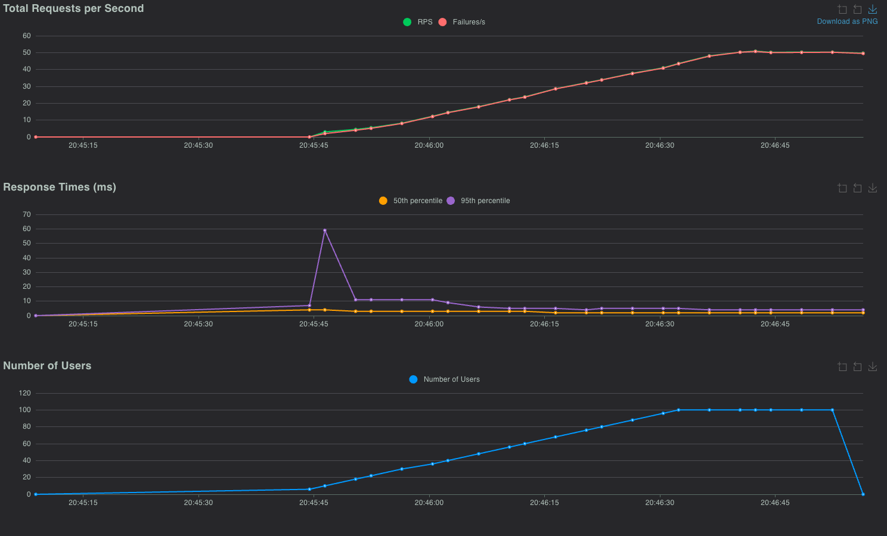

# Labo 04 — Rapport
 \
Reda El Mansouri ELMR90070104 \
Rapport de laboratoire \
LOG430 — Architecture logicielle \
2025-10-03 \
École de technologie supérieure

## Questions

#### Question 1 : Quelle réponse obtenons-nous à la requête à `POST /payments` ? Illustrez votre réponse avec des captures d'écran/terminal.

J'ai envoyé la requête POST suivante au gateway :
 ```zsh
 curl -i -X POST -H 'Content-Type: application/json' -d '{"user_id":1,"order_id":1,"total_amount":10.5}' http://localhost:8080/payments-api/payments.
 ```
  La réponse obtenue était un 500 Internal Server Error (voir capture/console jointe). Après inspection, le mapping de Krakend montre que l'endpoint est forwardé vers http://payments_api:5009/payments ; or, le service payments_api n'est pas présent dans le docker-compose.yml fourni, d'où l'échec.

  

#### Question 2 : Quel type d'information envoyons-nous dans la requête à POST payments/process/:id ? Est-ce que ce serait le même format si on communiquait avec un service SOA, par exemple ? Illustrez votre réponse avec des exemples et captures d'écran/terminal.

Dans notre architecture microservices, nous envoyons un corps JSON (REST) au endpoint `POST /payments/process/:id` via l'API Gateway. Ce JSON décrit la transaction de paiement (montant, devise, moyen de paiement, et données associées). Voici une capture d’écran Postman du Body utilisé pour le traitement du paiement :



Exemple représentatif du payload JSON (format REST/JSON) :

```json
{
  "amount": 39.98,
  "currency": "CAD",
  "method": "card",
  "card": {
    "number": "4111111111111111",
    "expiry": "12/26",
    "cvv": "123"
  },
  "metadata": {
    "order_id": 4,
    "user_id": 4
  }
}
```

Comparaison avec un service SOA (ex. SOAP/XML) : dans une approche SOA classique, on enverrait un message XML encapsulé dans une enveloppe SOAP, souvent contracté par un WSDL/XSD. Exemple équivalent en SOAP :

```xml
<soapenv:Envelope xmlns:soapenv="http://schemas.xmlsoap.org/soap/envelope/" xmlns:pay="http://example.com/payment">
  <soapenv:Header/>
  <soapenv:Body>
    <pay:ProcessPaymentRequest>
      <pay:PaymentId>123</pay:PaymentId>
      <pay:Amount>39.98</pay:Amount>
      <pay:Currency>CAD</pay:Currency>
      <pay:Card>
        <pay:Number>4111111111111111</pay:Number>
        <pay:Expiry>12/26</pay:Expiry>
        <pay:CVV>123</pay:CVV>
      </pay:Card>
      <pay:Metadata>
        <pay:OrderId>4</pay:OrderId>
        <pay:UserId>4</pay:UserId>
      </pay:Metadata>
    </pay:ProcessPaymentRequest>
  </soapenv:Body>
  </soapenv:Envelope>
```

Donc, en microservices, on privilégie REST+JSON (léger, flexible, facilement consommable par des clients web/mobiles). En SOA, on rencontre souvent SOAP/XML (plus verbeux, fortement typé, avec un contrat formel WSDL).


#### Question 3 : Quel résultat obtenons-nous de la requête à POST payments/process/:id?

Le traitement du paiement via `POST /payments/process/:id` (appelé au travers de l’API Gateway) retourne une réponse JSON indiquant le succès de l’opération et l’état de la transaction (ex. `processed`/`approved`). Ci-dessous, une capture Postman illustrant la requête de traitement et la réponse retournée :


Ensuite, on peut interroger le détail du paiement avec `GET /payments/:id` pour vérifier son état final (par exemple `processed`, les montants, timestamps, etc.). Voici la capture de la consultation du paiement :



Rappel : le `payment_id` est d’abord découvert à partir de la commande (Store Manager) ; avec `GET /orders/:id`, le champ `payment_link` contient l’URL vers l’API Gateway incluant l’identifiant du paiement :



En résumé :
- `POST /payments/process/:id` → effectue le traitement et renvoie un JSON confirmant l’opération (succès/échec et méta‑données).
- `GET /payments/:id` → permet de relire l’état du paiement après traitement.

#### Question 4 : Quelle méthode avez-vous dû modifier dans log430-a25-labo05-payment et qu'avez-vous modifié ? Justifiez avec un extrait de code.

Nous avons modifié la méthode (handler) qui traite `POST /payments/process/:id` dans le microservice **log430-a25-labo5-payment** (ex. `process_payment`). Une fois le paiement validé avec succès, cette méthode effectue un appel HTTP vers le Store Manager via l’API Gateway pour mettre à jour la commande (champ `is_paid` à `true`).

Extrait de code :

```python
import os
import requests

API_GATEWAY_URL = os.getenv("API_GATEWAY_URL", "http://api-gateway:8080")
STORE_PUT_URL = f"{API_GATEWAY_URL}/store-api/orders"

def process_payment(payment_id: int):
  order_id = get_order_id_from_payment(payment_id) 

  payload = {"order_id": order_id, "is_paid": True}
  try:
    resp = requests.put(
      STORE_PUT_URL,
      json=payload,
      headers={"Content-Type": "application/json"},
      timeout=5
    )
    resp.raise_for_status()
    data = resp.json()
    if not data.get("updated", False):
     
      pass
  except requests.RequestException as e:
    pass
```

#### Question 5 : À partir de combien de requêtes par minute observez-vous les erreurs 503 ? Justifiez avec des captures d'écran de Locust.

Avec Locust (100 users, spawn rate = 2/s, host = `http://api-gateway:8080`), les réponses HTTP 503 (Service Unavailable) apparaissent dès que le débit effectif dépasse ce plafond.

En effet, lors de notre test, les premières 503 apparaissent dès que le flux dépasse la limite de 10 requêtes/minute par client. La capture d’écran Locust (Graphes "Total Requests per Second" et "Failures/s") montre bien ce comportement : à mesure que le RPS augmente, la série des échecs/s (503) suit et se stabilise au‑delà du seuil.


Capture d’écran Locust (RPS vs Failures/s) :



#### Question 6 : Que se passe-t-il dans le navigateur quand vous faites une requête avec un délai supérieur au timeout configuré (5 secondes) ? Quelle est l'importance du timeout dans une architecture de microservices ? Justifiez votre réponse avec des exemples pratiques

Nous avons ajouté un endpoint lent dans `store_manager.py` et l’avons exposé via KrakenD avec un timeout backend de 5 secondes :

- Flask : `GET /test/slow/<int:delay_seconds>` qui fait un `time.sleep(delay_seconds)`
- KrakenD (`config/krakend.json`) : `GET /store-api/test/slow/{delay}` avec `timeout: "5s"`

Comportement observé dans le navigateur :

- `http://localhost:8080/store-api/test/slow/2` → Répond dans le délai → **200 OK** avec :
  `{ "message": "Response after 2 seconds" }`
- `http://localhost:8080/store-api/test/slow/10` → Dépasse le timeout (5s) → le gateway interrompt l’appel backend et renvoie une erreur côté client. Dans notre cas, KrakenD retourne `500 Internal Server Error` avec l’en‑tête `X-Krakend-Completed: false` (selon la configuration, un 504 Gateway Timeout peut aussi être observé). Le corps est vide ou minimal.

Exemples pratiques :

- Appel utilisateur (front) : un bouton qui déclenche une action lente doit échouer rapidement et informer l’utilisateur, plutôt que spinner indéfiniment.
- Agrégation côté gateway : si un des agrégats est trop lent, le gateway peut répondre partiellement ou avec une erreur rapide, évitant d’empiler des requêtes en file.
- Traitements batch/idempotents : coupler timeout + retry (ex. 3 tentatives avec backoff) permet de surmonter des lenteurs transitoires sans impacter l’expérience globale.

En résumé, avec un délai supérieur à 5s, la requête échoue côté gateway (erreur 500/504 selon configuration), ce qui démontre l’utilité du timeout pour protéger le système et éviter les dégradations en chaîne.

